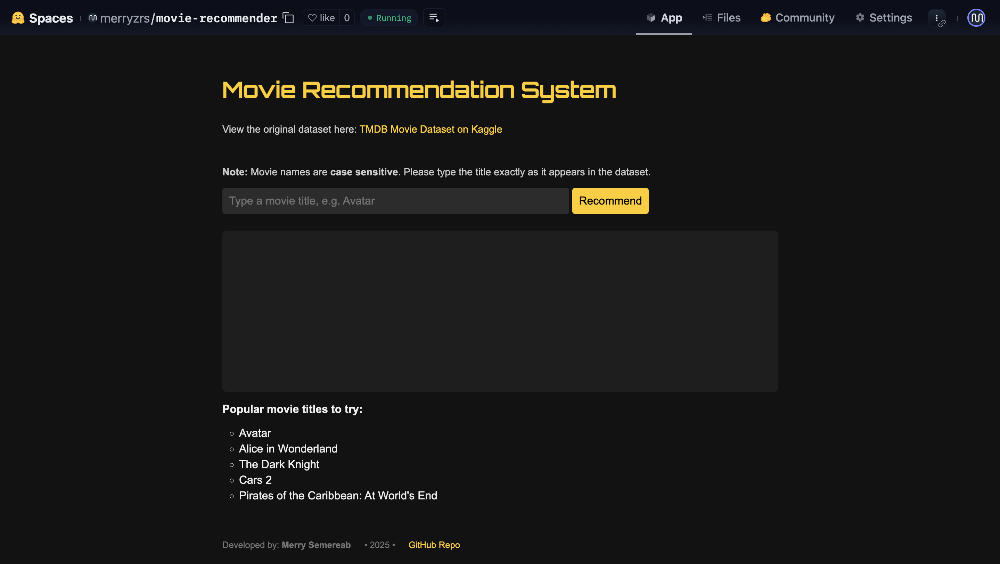

<div align='center'>
<h1>Movie Recommendation System</h1>

 <h4> <a href=https://huggingface.co/spaces/merryzrs/movie-recommender>View Demo</a> <span> · </span> <a href="https://github.com/semereab-merry/movie-recommendation/blob/master/README.md"> Documentation </a> <span> · </span> <a href="https://github.com/semereab-merry/movie-recommendation/issues"> Report Bug </a> <span> · </span> <a href="https://github.com/semereab-merry/movie-recommendation/issues"> Request Feature </a> </h4>
</div>


 
Welcome to the **Movie Recommendation System** – an interactive web application that suggests similar movies based on your input. I built this project using a content-based filtering approach trained on the [TMDB Movie Dataset](https://www.kaggle.com/datasets/tmdb/tmdb-movie-metadata).


## ⭐ Problem Statement

With the overwhelming number of movies released each year, finding new films that match one’s taste can be difficult. I aimed to solve this problem by building an intelligent system that recommends similar movies based on a single user-provided movie title. This helps users discover new content quickly and easily, without manually searching.

## 💼 Approach & Methodology

I used a **content-based recommendation** system that analyzes metadata such as genres, keywords, cast, crew, and overview to create a feature vector for each movie. I then applied the **K-Nearest Neighbors (KNN)** algorithm with **cosine similarity** to find and suggest the most similar movies.

### 🛠️ My Steps:
1. **Data Preprocessing**: I cleaned and transformed the TMDB dataset, extracting and structuring key features such as cast, director, genres, and keywords.
2. **Feature Engineering**:  I created a pivot table of movie features, converting categorical and textual attributes into numerical form. This pivot table was then transformed into a sparse matrix using csr_matrix from SciPy to efficiently represent the high-dimensional data.
3. **Model Training**: I used the NearestNeighbors algorithm with the cosine distance metric to find similar movies based on the feature matrix.
4. **Recommendation Function**:  I implemented a function that accepts a movie title, finds its index, and retrieves the top 5 most similar movies.
5. **Deployment**:The app is uploaded into Huggingface; along with the model for deployement. 

## ⚙️ How to Use

1. Visit the [live demo](https://huggingface.co/spaces/merryzrs/movie-recommender)
2. Enter a **case-sensitive** movie title (e.g., `Avatar`)
3. Click "Recommend" to view similar movies
4. Enjoy the suggestions!

### 🏃 Run Locally

Clone the project

```bash
https://github.com/semereab-merry/movie-recommendation.git
```
Go to the project directory
```bash
cd movie-recommendation
```
Install dependencies
```bash
pip install -r requirements.txt
```
Run the webapp locally after you run all the code blocks in movie_recommendation_system.ipynb
```bash
python app.py
```


## 💻 Technologies Used

- Python, Flask
- Scikit-learn, Pandas, Joblib
- HTML, JavaScript, CSS
- Huggingface (for deployment)


## 🎊 Conclusion

This project showcases how machine learning and content-based filtering can be applied to solve real-world problems in the entertainment space. By building a personalized recommender and deploying it as a live web app, I created a practical and engaging way for users to discover movies they’re likely to enjoy. Hosting the model externally made the solution deployable and scalable despite file size constraints.

---

### Developed By

Merry Semereab | 2025  
[GitHub Profile](https://github.com/semereab-merry)
